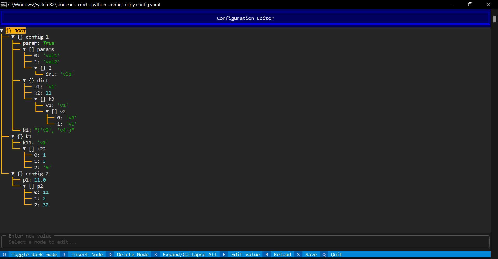
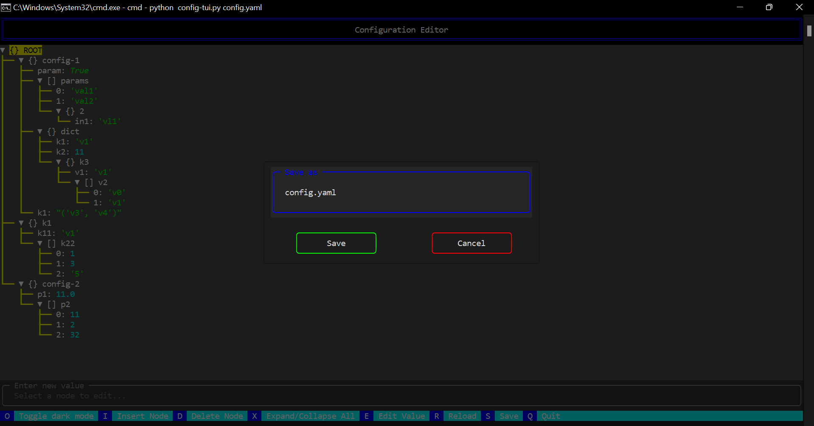

# Configuration Editor TUI (__ConfigTUI__)

Enhancing the experience of editing YAML files, especially when dealing with large files or when using Linux editors, can be a challenging task. To address this, we present "config-tui", a minimalist and intuitive Text User Interface (TUI) tool designed specifically for effortless viewing and editing of YAML files. With its clean and user-friendly interface, config-tui simplifies the process, making YAML file manipulation a breeze.
```
config-tui: where YAML editing gets a friendly and quirky makeover! We make YAML editing an absolute delight :)
```
 - version: `1.1` - [2023-06-06]

## Pre-requisites
```
python >= 3.9
pip >= 20.0.0
```
## Installation
 - Copy the folder _config-tui_ to desired folder
 - Install pip dependencies: 
    ```
    pip install -r requirements.txt
    ```
## Usage
```
python config-tui.py -i [yaml-file-to-be-edited]
```
 - Run this command for more details: `python config-tui.py -h`
 - Tested on:
   - Windows
   - Linux

## Todo list
- [x] Edit and Save YAML file
- [ ] Ability to search within tree
- [x] Add / remove new items in the yaml

## Limitations
 - Cannot preserve comments or any decorators on saving a yaml file

## Examples
 - Viewing yaml files: 
 - Save yaml configuration file: 

## Author
 - Prudhvi Ch

## Known issues & Fixes
 - By default, ConfigTUI has the ability to infer data types and do type conversions. It can be overridden by passing `--enable-strict-data-types` as a CLI option
 - By default, ConfigTUI does not allow to edit key of a nested value. It can be overridden by passing `--edit-dict-keys` as a CLI option
 - For inferring any value as string explicitly, encapsule the value in quotes while modifying

## Behind-the-scenes of Development
Below are some other tools which I explored and their reason of rejection:
1.	pyfx: only view and is limited to linux
2.	config-suite: requires defining yaml schema which is not properly documented
3.	npyscreen: no proper documentation
4.	urwid: does not work with windows
5.	curses: requires very minute level coding even for a trivial task
6.	gum: wonderful tool but not suited for json/yaml trees
7.	tson: no longer maintained and requires golang installation

The choice is _Textual_ which is a rapidly growing popular framework for building TUI apps. Textual adds interactivity to Rich with is an API inspired by modern web development.
